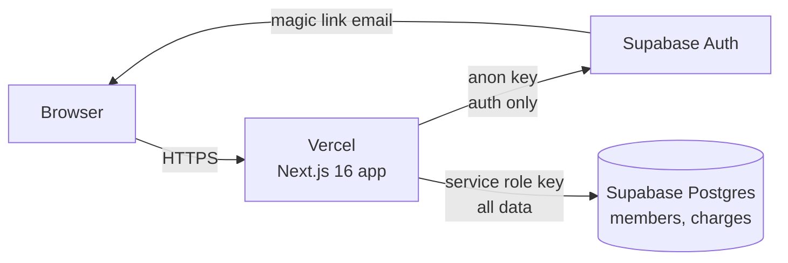
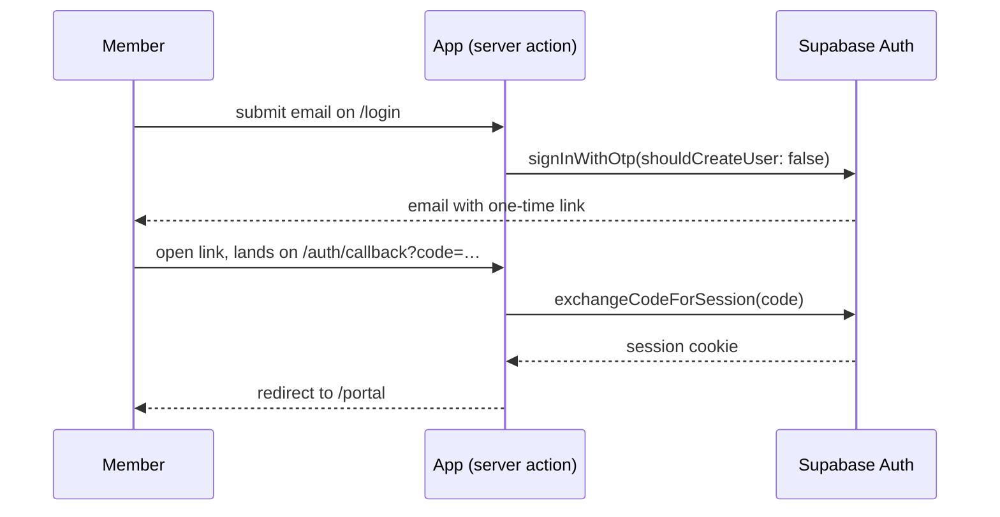

# Chi Chapter Member Portal — How It Works

As of 2026-09-20. Living copy: https://claude.ai/code/artifact/a198e89b-c3b9-4d65-99c8-753df53dd208

## What it is

The portal lets a brother sign in and see what he owes the chapter, and lets exec assign charges and
mark them paid. It lives at `/portal` on the chapter site; the public pages (home, about, membership,
news) are untouched and still fully static.

Scope is deliberately small: one balance per member, one list of charges, no online payment. Members
pay the treasurer by Venmo or Zelle and exec records it.

## Stack and architecture

Two services, both on free tiers: Vercel runs the Next.js 16 app, Supabase holds the Postgres database
and issues magic-link sign-ins. The browser never talks to the database directly; every read and write
goes through server code on Vercel.

The app uses the Supabase **anon key** only to find out who is signed in, and the **service role key**
for every query. That split is what makes the security model simple (see Security model below).

| Piece | Where it runs | What it does |
| --- | --- | --- |
| Public pages | Vercel, static | Home, about, membership, news. No database, no auth |
| `proxy.ts` | Vercel, every `/portal`, `/login`, `/auth` request | Refreshes the session cookie; redirects logged-out users to `/login` |
| Portal pages | Vercel, server-rendered per request | `/login`, `/portal`, `/portal/exec` |
| Server actions | Vercel, on form submit | Send link, add charge, mark paid, add member, etc. |
| Supabase Auth | Supabase | Stores logins, sends magic-link emails, validates them |
| Supabase Postgres | Supabase | Two tables: `members` and `charges` |

## Data model

Two tables. A member's balance is the sum of his charges that have no `paid_at`.

**members**

| Column | Type | Notes |
| --- | --- | --- |
| `id` | uuid | primary key |
| `email` | citext, unique | the login gate; matched case-insensitively against the Supabase auth user |
| `name` | text | |
| `role` | text | `member`, `exec`, or `admin` (admin = exec + remove members + grant admin) |
| `active` | bool | `false` = inactive/alumni; excluded from bulk dues |
| `created_at` | timestamptz | |

**charges**

| Column | Type | Notes |
| --- | --- | --- |
| `id` | uuid | primary key |
| `member_id` | uuid | references `members`, cascade delete |
| `amount_cents` | int | $300.00 is stored as 30000; must be positive |
| `description` | text | "Fall 2026 dues", "Missed chapter 9/8" |
| `paid_at` | timestamptz, nullable | null = still owed |
| `created_at` | timestamptz | |

Dues and fines are the same thing: a charge. Bulk dues is one charge row per active member sharing a
description. Marking paid sets `paid_at`; forgiving a charge deletes it.

Trade-offs accepted for v1: no partial payments (delete and re-create a smaller charge) and no audit
trail of who changed what.

## Sign-in flow

Two ways in, both on `/login`:

- **Password** (`signInWithPassword`). Members set one from the "Password" card on `/portal`, or exec
  can give a temporary one in the "Add member" form or, for someone already on the roster, the
  "Set a member's password" form (which also lifts a lockout).
- **Magic link.** A member types their email, gets a one-time link, and clicking it signs them in.
  This is the fallback for anyone without a password.

Three rules that follow from this:

1. **Only roster emails get a link.** `shouldCreateUser: false` means an email with no Supabase auth
   user is silently ignored. The login page shows the same "if that email is on the roster…" message
   either way, so a stranger learns nothing.
2. **A login is created by exec, not by the member.** The "Add member" form on `/portal/exec` inserts
   the roster row and calls `auth.admin.createUser({ email_confirm: true })`. No invite email is sent;
   the member just goes to `/login`.
3. **Open the link on the device that requested it.** The flow is PKCE: the browser that asked for the
   link holds a verifier cookie the callback needs. Request on laptop, tap on phone → "link expired" →
   request again on the phone. The login page explains this when it happens.

After sign-in, `getCurrentMember()` looks up the roster row by the auth user's email. If someone has a
Supabase login but no `members` row, they are treated as logged out.

## Security model

All authorization lives in one file, `lib/portal/auth.ts`, and the database refuses everything that
doesn't come through it.

| Layer | What it does | Why it's safe |
| --- | --- | --- |
| Postgres RLS | Enabled on `members` and `charges` with **zero policies** | The public anon key can't read or write a single row, even if someone extracts it from the browser bundle |
| Service role key | Used for every query, from server code only | Bypasses RLS, so it must never reach the browser. It lives in `SUPABASE_SERVICE_ROLE_KEY` (no `NEXT_PUBLIC_` prefix) and is imported only by `lib/supabase/admin.ts` |
| `requireMember()` | First line of every portal page and action; redirects to `/login` if no roster row matches | Members can only ever see queries scoped to their own `member.id` |
| `requireExec()` | First line of every exec page and mutating action; redirects to `/portal` unless role is `exec` or `admin` | A member can't call an exec server action by guessing its name; the check runs server-side inside the action |
| `proxy.ts` | Redirects logged-out users away from `/portal` before the page renders | Convenience and cookie refresh only; it is **not** the security boundary |

Things a member cannot do, by construction: write to `charges`, see anyone else's charges, change
their own role, or create a login for someone else. Things exec can do that aren't logged: delete a
charge, mark paid, deactivate a member. If that ever matters, the fix is an audit table, not a policy
change.

## Pages and actions

Four routes and nine server actions cover the whole portal.

| Route | Who | Shows |
| --- | --- | --- |
| `/login` | anyone | Email field; "check your inbox" after submit; expired-link notice |
| `/auth/callback` | link click | No UI; exchanges the code for a session and redirects to `/portal` |
| `/portal` | signed-in member | "You owe $X", outstanding charges, Venmo/Zelle instructions, paid history |
| `/portal/exec` | exec | Total outstanding, charge-one form, charge-all form, outstanding list with mark paid/delete, roster with balances, add member, recently paid with undo |

Every form posts to a server action in `lib/portal/actions.ts`. Actions run on Vercel, never in the
browser, and each one starts with `requireExec()` (or nothing extra, for the two auth actions).

| Action | Gate | Effect |
| --- | --- | --- |
| `sendMagicLink` | none | Sends the one-time link if the email has a login |
| `signOut` | none | Clears the session, redirects to `/login` |
| `addCharge` | exec | Inserts one charge for one member |
| `chargeAllActives` | exec | Inserts one charge per member with `active = true` |
| `markPaid` | exec | Sets `paid_at = now()` |
| `markUnpaid` | exec | Sets `paid_at = null` (undo) |
| `deleteCharge` | exec | Deletes the row |
| `addMember` | exec | Inserts roster row, creates the Supabase login |
| `setMemberActive` | exec | Toggles `active` |
| `setMemberRole` | exec | Changes a member's role; only admins can touch admins or grant admin |
| `removeMember` | admin | Deletes the roster row, its charges, and the login |

After any mutation the action calls `revalidatePath('/portal', 'layout')` so both portal pages
re-render with fresh data on the next request.

## Running it day to day

Everything exec does happens on `/portal/exec`; nothing requires the Supabase dashboard after setup.

| Task | How |
| --- | --- |
| Add a brother | Roster → Add member → name, email, role → "Add & send invite". Tell him to go to `/login`. No email is sent by the app. |
| Charge semester dues | Charge all actives → description ("Fall 2026 dues"), amount each → submit. One row per active member. |
| Fine one person | Charge one member → pick him, description, amount. |
| Record a payment | Wait for the Venmo/Zelle to land, then Outstanding charges → Mark paid next to that row. |
| Undo a wrong "paid" | Recently paid → Undo. |
| Forgive or fix a charge | Delete it. For a partial payment, delete and re-add the remaining amount. |
| Brother graduates or goes inactive | Roster → Deactivate. He keeps his login and can still see old charges; he's skipped by "charge all actives". |
| Change the treasurer's Venmo/Zelle | Edit `lib/portal/config.ts` and redeploy. |

Members see one screen: total owed, the outstanding list, how to pay, and a paid history. They can't
change anything.

## Code map

The portal is about 15 files; the public site is untouched.

| File | Purpose |
| --- | --- |
| `proxy.ts` | Next 16's middleware. Refreshes Supabase cookies, redirects on `/portal` and `/login` |
| `lib/supabase/server.ts` | Anon-key client bound to request cookies; identifies the user |
| `lib/supabase/admin.ts` | Service-role client; all data queries. Server only |
| `lib/supabase/proxy.ts` | Cookie-refresh helper used by `proxy.ts` |
| `lib/portal/auth.ts` | `getCurrentMember`, `requireMember`, `requireExec` |
| `lib/portal/queries.ts` | Read queries: charges for a member, roster with balances, all charges |
| `lib/portal/actions.ts` | All server actions (the nine listed above) |
| `lib/portal/format.ts` | Cents ↔ dollars, date formatting |
| `lib/portal/config.ts` | Venmo/Zelle handles shown on `/portal` |
| `app/login/page.tsx` + `components/portal/LoginForm.tsx` | Login page and its client form |
| `app/auth/callback/route.ts` | Exchanges the magic-link code for a session |
| `app/portal/layout.tsx` | Portal nav (My Dues / Exec / Sign out); calls `requireMember` |
| `app/portal/page.tsx` | Member view |
| `app/portal/exec/page.tsx` | Exec view |
| `components/portal/ActionForm.tsx` | Client wrapper that runs an action and shows its error/success |
| `supabase/schema.sql`, `seed.sql`, `README.md` | Tables, roster seed, dashboard setup steps |
| `PLAN.md` | The decisions behind all of this |

## Configuration

Three environment variables, set in Vercel (Settings → Environment Variables) and in `.env.local` for
local dev. `.env.local` is gitignored; `.env.example` shows the names.

| Variable | Source in Supabase | Vercel type |
| --- | --- | --- |
| `NEXT_PUBLIC_SUPABASE_URL` | Project Settings → API → Project URL | plain |
| `NEXT_PUBLIC_SUPABASE_ANON_KEY` | Project Settings → API → anon / publishable key | plain |
| `SUPABASE_SERVICE_ROLE_KEY` | Project Settings → API → service_role / secret key | **secret** |

Supabase dashboard settings that must be right:

- **Authentication → URL Configuration**: Site URL = the Vercel URL; Redirect URLs include
  `https://<vercel-url>/auth/callback` and `http://localhost:3000/auth/callback`.
- **Authentication → Users**: your own login was created here once ("Create new user", auto-confirm).
  Every other login comes from the Add member form.
- **SQL Editor**: `supabase/schema.sql` was run once. Re-running it would fail on the existing tables,
  which is fine.

Email templates are left at Supabase's defaults. Editing them requires custom SMTP, which the app
doesn't need.

## Known limits and what to revisit

None of these block using the portal today. Listed roughly in the order they're likely to bite.

| Limit | Effect | Fix when needed |
| --- | --- | --- |
| Supabase free tier pauses after 7 days idle | First visit after a quiet week fails until someone clicks Restore in the dashboard | A weekly ping (cron hitting `/login`), or Pro at ~$25/mo |
| Same-device magic links | Request on laptop, tap on phone = expired link | Custom SMTP (Resend, needs a domain) unlocks token-hash templates that work anywhere |
| Built-in email is rate-limited (a few per hour) | If 30 brothers log in the same evening, some links are delayed | Same fix: custom SMTP |
| No partial payments | Exec deletes and re-adds a smaller charge | Add a `payments` table and make balance = charges − payments |
| No audit trail | Can't see who marked what paid or deleted a charge | Add `created_by` / `updated_by` columns or an `events` table |
| No online payment | Members pay Venmo/Zelle, exec marks paid by hand | Stripe Checkout: a "Pay now" button creates a session for one charge; a webhook route sets `paid_at`. About 150 lines, but 2.9% + 30¢ per payment and a bank account on file |

**Open question with nationals.** ODPhi rolled out GreekTrack org-wide in summer 2026, which includes
rosters and "secure dues collection." Whether chapters are required to collect dues through it is
unconfirmed. Ask vp.finance@omegadeltaphi.org or the Central Texas RD before the first bulk dues run;
if the answer is yes, this portal becomes fines-and-tracking only, or links out.
